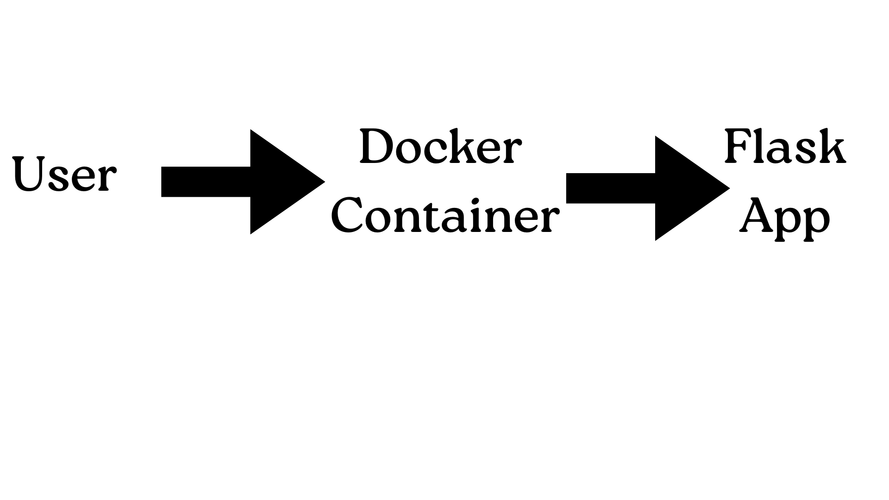

# QR Code Generator Service

## 1) Executive Summary
**Problem:** In field operations, users often need to quickly share complex URLs or text data between devices without access to physical cables or complex syncing infrastructure. Manual data entry is error-prone and slow, and proprietary sharing tools frequently fail when moving data between different operating systems (for example, from a laptop to an Android phone).

**Solution:** This project provides a lightweight, universal tool that instantly converts any text or web link into a standard QR code image. Running as a self-contained service, it allows users to generate shareable codes on demand without relying on potentially unsafe third-party websites or installing heavy applications. The resulting QR codes can be scanned immediately by any smartphone camera, ensuring seamless data transfer between devices regardless of the hardware involved.


## 2) System Overview
**Course Concept(s):** **Flask API**. This project implements a **Flask API** to process data pipelines. It receives JSON payloads and returns image data using standard HTTP methods. I mostly utilized Case 4-5 concepts to complete this project.

**Architecture Diagram:**
This diagram shows the flow of data: a user sends a request, it enters the secure Docker container, and the Python app inside generates the image.


**Data/Models/Services:**
* **Input Data:**
    *Source:* User-provided text strings or URLs via HTTP POST.
    *Format:* JSON Payload (`application/json`).
    *Size:* Text payloads are typically small (< 1KB).
* **Processing Service:**
    *Tool:* `qrcode` Python Library (Version 7.x).
    *License:* BSD-3-Clause Licensed.
* **Output Data:**
    *Format:* Binary PNG Image (`image/png`).
    *Size:* Optimized raster images, typically 1KB - 5KB depending on complexity.


## 3) How to Run (Local)
**Docker:**
```bash
./run.sh
```

## 4) Design Decisions
**Why this concept:** I chose a Flask API because it keeps the "heavy lifting" (making the image) separate from the user interface. This makes the system cleaner and easier to maintain. By using a container, I ensured this tool runs exactly the same on any computer—whether it's my laptop, a cloud server, or a field device.
    *Alternatives Considered:* I considered building a simple command-line (CLI) script instead of a web server. I didn't choose this option because while a CLI is     simpler, it can only be used by the person sitting at that specific computer. An API architecture was chosen because it allows the tool to be accessed remotely by mobile phones or other applications, which is much more useful in a real-world "Systems" context.

**Tradeoffs:** *Memory vs Disk:* I chose to process images in-memory (io.BytesIO) to keep the container stateless and fast, rather than saving files to disk. 
**Security/Privacy:** *Stateless:* No user data is logged or saved to a database, ensuring privacy by design.
**Ops:** *Health Check*:* A **/health** endpoint is included for container orchestration.


## 5) Results and Evaluation
**Sample Output:** Below is a QR code generated by the service:


**Performance & Resources:** The application is extremely lightweight, using the python-slim base image to keep the footprint small (~150MB). Startup time is negligible (<1 second), and memory usage remains low because images are streamed directly to the client without disk I/O.

**Validation Outcomes:**
    *Smoke Test:* Verified GET /health returns 200 OK and {"status": "healthy"}.
    *Functional Test:* Verified POST /generate with a URL payload successfully produces a valid PNG file (confirmed via curl output and visual inspection).


## 6) What's Next
**Frontend UI:** Build a simple HTML/JS interface so users can generate codes via a browser instead of using terminal commands (curl).

**Format Support:** Add support for SVG (Scalable Vector Graphics) output for high-quality printing. This can help in reading QR codes. 

**Ops & Security:** Implement a rate limiter to prevent API abuse and add a Redis cache to store frequently generated codes (e.g., for the company homepage) to reduce CPU load.


## 7) Links
**GitHub Repo:** https://github.com/liamscanlon5/SystemsFinalProject_QR-Code-Repository.git

**Public Cloud App:** https://systemsfinalproject-qr-code-repository.onrender.com/health

## 8) Acknowledgements and Academic Integrity
Development assisted by LLM prompting (Gemini) for boilerplate code generation and documentation formatting.
